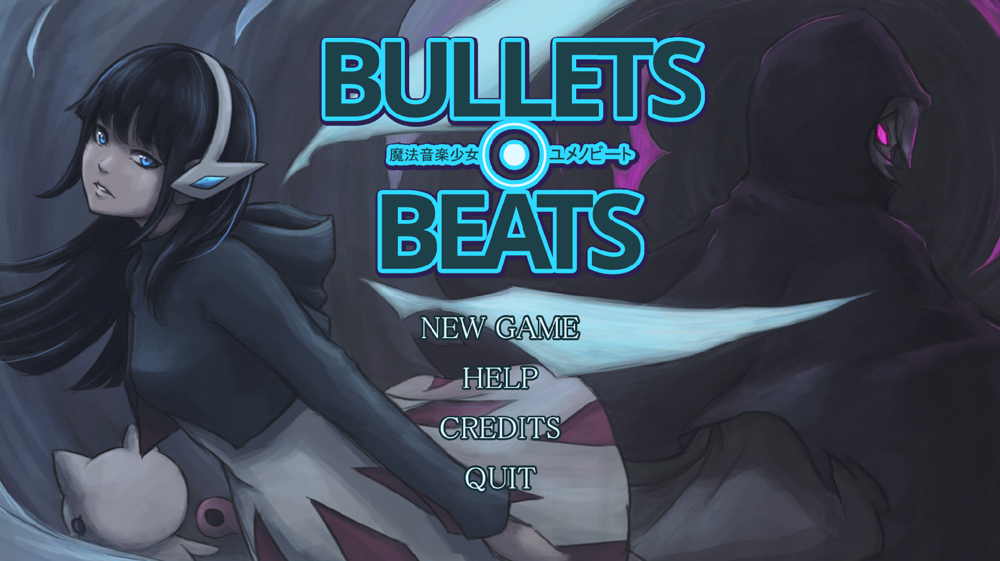
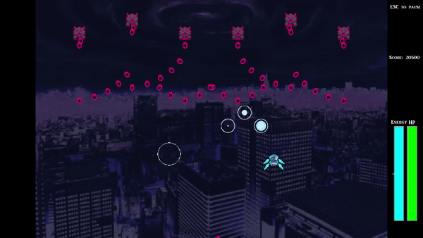

= Bullets and Beats

ifdef::env-github[]

endif::[]

Gameplay involves collecting "Beats" as a form of ammunition to defeat your enemies. "Beats" spawn according to the beat of the music played, and collecting them at the right time will give more benefits!

Here are some clips of the gameplay!

ifdef::env-github[]
.Pulse ability

endif::[]

ifdef::env-github[]
.Chaotic boss fight
image:videos/ChaoticBossFight.gif[]
endif::[]

== Developers' Notes

Hello! This game was created for a game design module (NM3216) in National
University of Singapore by Spencer Tan, Ng Hui Ren, Ng Jing Heng, Kelly Lim and
Rahmani Nitiyudo. Hope you have fun! Do drop feedback on the GitHub page,
constructive comments are appreciated!

Feel free to share the game as long as no profits are being made from it!
